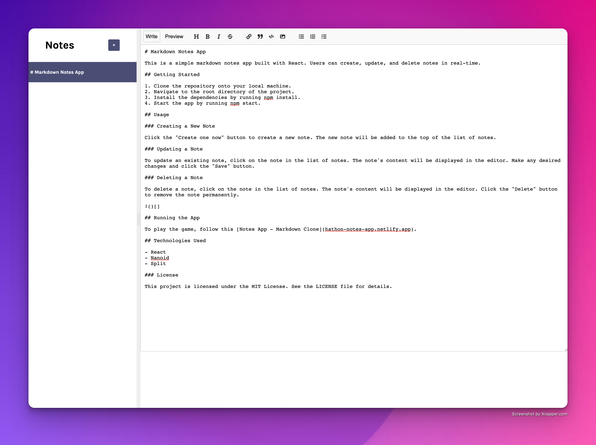
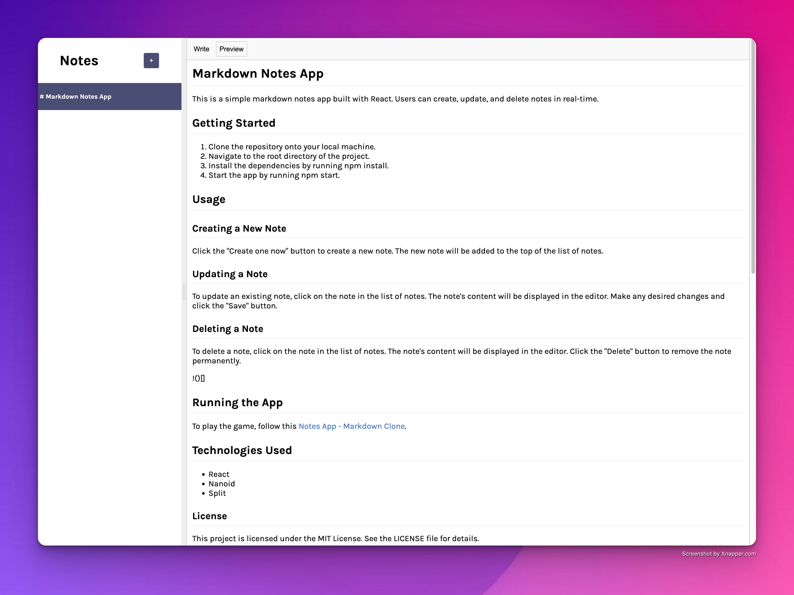

# Markdown Notes App

This is a simple markdown notes app built with React. Users can create, update, and delete notes in real-time.

## Getting Started

1. Clone the repository onto your local machine.
2. Navigate to the root directory of the project.
3. Install the dependencies by running npm install.
4. Start the app by running npm start.

## Usage

### Creating a New Note

Click the "Create one now" button to create a new note. The new note will be added to the top of the list of notes.

### Updating a Note

To update an existing note, click on the note in the list of notes. The note's content will be displayed in the editor. Make any desired changes and click the "Save" button.

### Deleting a Note

To delete a note, click on the note in the list of notes. The note's content will be displayed in the editor. Click the "Delete" button to remove the note permanently.

## Running the App

To play the game, follow this [Notes App - Markdown Clone](hathon-notes-app.netlify.app).

## Technologies Used

- React
- Nanoid
- Split

### License

This project is licensed under the MIT License. See the LICENSE file for details.
